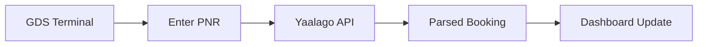

## Overview

Yaalago provides powerful tools tailored for travel agencies. You manage clients efficiently, automate bookings, and track commissions seamlessly. This guide covers the centralized dashboard, client profiles with tagging, and PNR parsing for GDS integration.

<Columns cols={3}>
  <Card title="Centralized Dashboard" icon="activity" href="#dashboard">
    View bookings, tasks, and finances in one place.
  </Card>
  <Card title="Client Profiles" icon="users" href="#clients">
    Organize profiles, documents, and tags for quick access.
  </Card>
  <Card title="PNR Parsing" icon="file-text" href="#pnr">
    Convert GDS codes into readable booking data.
  </Card>
</Columns>

<Callout kind="info">
  Start by logging into your Yaalago dashboard at `https://dashboard.yaalago.com` to explore these features.
</Callout>

## Centralized Dashboard Navigation

Access all key information from the main dashboard. You see real-time updates on bookings, pending tasks, and financial summaries.

<Steps>
  <Step title="Log In" icon="log-in">
    Enter your credentials at the login page.
  </Step>
  <Step title="Review Overview" icon="activity">
    Check the top widgets for daily metrics like new bookings and commissions.
  </Step>
  <Step title="Navigate Sections" icon="layout">
    Use the sidebar to switch between `Bookings`, `Clients`, and `Finances`.
  </Step>
</Steps>

Customize your dashboard by dragging widgets. Pin frequent reports for faster access.

## Client Profiles and Tagging

Build detailed client profiles to streamline service. You store contact info, travel history, documents, and custom tags.

<Tabs>
  <Tab title="Create Profile" icon="user-plus">
    Fill in basic details like name, email, and preferences.

    ```javascript
    // Example profile data structure
    const clientProfile = {
      name: "John Doe",
      email: "john@example.com",
      tags: ["VIP", "Frequent Flyer"],
      documents: ["passport.pdf", "visa.jpg"]
    };
    ```
  </Tab>
  <Tab title="Apply Tags" icon="tag">
    Add tags for segmentation, such as `Europe Tours` or `Family Travel`.

    <Callout kind="tip">
      Merge duplicate profiles automatically to avoid data silos.
    </Callout>
  </Tab>
</Tabs>

<Expandable title="Advanced Tagging" default-open="false">
  Use tag hierarchies for better organization. For example, parent tag `Destinations` with children `Europe` and `Asia`.
</Expandable>

## PNR Parsing and GDS Integration

Parse Passenger Name Records (PNR) from Global Distribution Systems (GDS) like Amadeus or Sabre. Yaalago converts raw codes into structured data.

<CodeGroup tabs="JavaScript,Python">
  ```javascript
  // Parse PNR via API
  const response = await fetch('https://api.example.com/pnr/parse', {
    method: 'POST',
    headers: { 'Authorization': 'Bearer YOUR_API_KEY' },
    body: JSON.stringify({ pnr: 'ABC123' })
  });
  const booking = await response.json();
  console.log(booking.passengers); // Readable data
  ```
  ```python
  import requests

  response = requests.post('https://api.example.com/pnr/parse',
    headers={'Authorization': 'Bearer YOUR_API_KEY'},
    json={'pnr': 'ABC123'}
  )
  booking = response.json()
  print(booking['passengers'])  # Readable data
  ```
</CodeGroup>

<ParamField path="pnr" param-type="string" required="true">
  The raw PNR code from your GDS terminal.
</ParamField>

<ParamField header="Authorization" param-type="string" required="true">
  Bearer token for secure access.
</ParamField>



## Best Practices and Next Steps

Combine these features for maximum efficiency. Tag clients during PNR import to automate follow-ups.

<Columns cols={2}>
  <Card title="Automation Guide" icon="zap" href="/automation">
    Set up task workflows.
  </Card>
  <Card title="Commission Tracking" icon="dollar-sign" href="/commissions">
    Monitor earnings automatically.
  </Card>
</Columns>

<Callout kind="success">
  These tools save hours weekly. Experiment in a test account first.
</Callout>