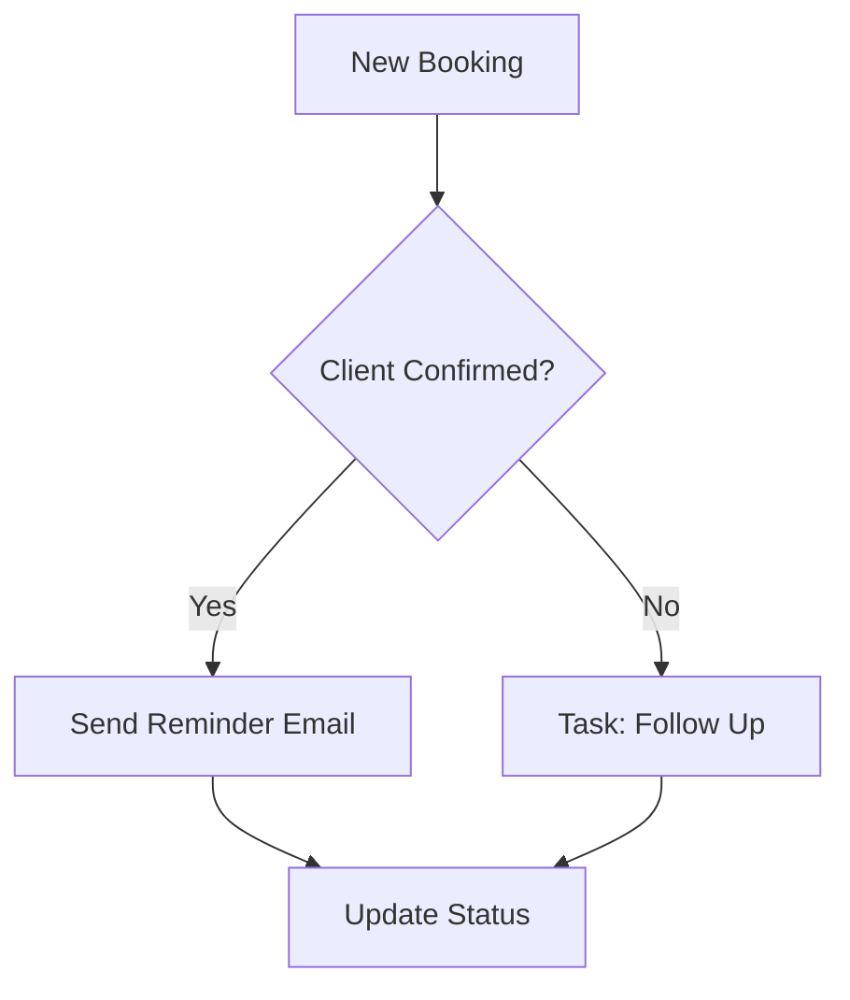

## Overview

Yaalago integrates seamlessly with popular payment processors, automation tools, and proposal services to streamline your travel agency operations. Set up payment providers for secure transactions, automate tasks with reminders, and generate branded proposals effortlessly.

<Callout kind="info">
  All integrations use Yaalago's secure API at `https://api.yaalago.com/v1`. Obtain your `{API_KEY}` from the dashboard settings.
</Callout>

## Payment Provider Setup

Connect Stripe, PayPal, or other processors to handle client payments directly within Yaalago.

<Steps>
  <Step title="Generate API Credentials" icon="key">
    Log in to your payment provider dashboard. Create a new API key with payment processing permissions.

    ```bash
    # Example: Stripe dashboard export
    export STRIPE_SECRET_KEY=sk_test_your_stripe_key_here
    ```
  </Step>
  <Step title="Configure in Yaalago" icon="settings">
    Navigate to Yaalago Dashboard > Integrations > Payments. Enter your credentials.
  </Step>
  <Step title="Test the Connection" icon="zap">
    Create a test booking and process a `{1.00}` payment to verify the integration.
  </Step>
</Steps>

<Tabs>
  <Tab title="Stripe" icon="dollar-sign">
    Use Stripe Connect for payouts to suppliers.

    <ParamField header="Stripe-Signature" param-type="string" required="true">
      Webhook signature header for event verification.
    </ParamField>

    ```javascript
    // Verify Stripe webhook in Yaalago custom script
    const stripe = require('stripe')('sk_test_your_key');
    const sig = req.headers['stripe-signature'];
    const event = stripe.webhooks.constructEvent(payload, sig, 'your_webhook_secret');
    ```
  </Tab>
  <Tab title="PayPal" icon="paypal">
    Enable PayPal Express Checkout.

    ```javascript
    // PayPal API call example
    fetch('https://api.paypal.com/v2/checkout/orders', {
      method: 'POST',
      headers: {
        'Authorization': `Bearer ${YOUR_PAYPAL_TOKEN}`,
        'Content-Type': 'application/json'
      },
      body: JSON.stringify({
        intent: 'CAPTURE',
        purchase_units: [{ amount: { currency_code: 'USD', value: '100.00' } }]
      })
    });
    ```
  </Tab>
</Tabs>

## Task Automation and Reminders

Automate follow-ups, reminders, and workflows using Zapier, Make.com, or Yaalago's built-in rules.



<Columns cols={2}>
  <Card title="Zapier" icon="zap" href="https://zapier.com/apps/yaalago/integrations" target="_blank">
    Connect Yaalago to 5000+ apps. Trigger tasks on new bookings.
  </Card>
  <Card title="Built-in Rules" icon="settings" href="/configuration">
    No-code automation for reminders and status updates.
  </Card>
</Columns>

<CodeGroup tabs="Zapier Webhook,Make.com">
  ```javascript
  // Zapier webhook trigger on booking created
  POST https://hooks.zapier.com/hooks/catch/YOUR_ZAP_ID/
  {
    "event": "booking.created",
    "client_email": "client@example.com",
    "due_date": "2024-12-01"
  }
  ```
  ```javascript
  // Make.com scenario JSON
  {
    "module": "http:MakeRequest",
    "url": "https://api.yaalago.com/v1/tasks",
    "headers": {
      "Authorization": "Bearer YOUR_API_KEY"
    },
    "body": {
      "action": "remind",
      "client_id": "{{1}}"
    }
  }
  ```
</CodeGroup>

## Proposal Generation and Branding

Create customized, branded proposals with integrated payments. Upload your logo and templates.

<Expandable title="Advanced Branding Options" default-open="false">
  Customize fonts, colors (use your brand color `#414e9f`), and payment gateways.

  | Option       | Description                          | Default |
  |--------------|--------------------------------------|---------|
  | Logo URL     | Your agency logo                     | None   |
  | Primary Color| Brand accent color                   | `#414e9f` |
  | Template     | Proposal layout (Modern/Classic)     | Modern |

  <Callout kind="tip">
    Test proposals with sample data before sending to clients.
  </Callout>
</Expandable>

<Steps>
  <Step title="Upload Branding" icon="image">
    Go to Proposals > Branding. Upload logo and set colors.
  </Step>
  <Step title="Generate Proposal" icon="file-text">
    Select a booking, click "Create Proposal", and send via email or link.
  </Step>
</Steps>

## Next Steps

Explore more integrations in your Yaalago dashboard or [schedule a demo](https://yaalago.com/schedule-demo).

<Columns cols={3}>
  <Card title="API Reference" icon="code" href="/api-reference">
    Build custom integrations.
  </Card>
  <Card title="Workflow Examples" icon="play" href="/guides">
    Ready-to-use automation templates.
  </Card>
  <Card title="Support" icon="help-circle" href="https://yaalago.com/support" target="_blank">
    Get help from our team.
  </Card>
</Columns>